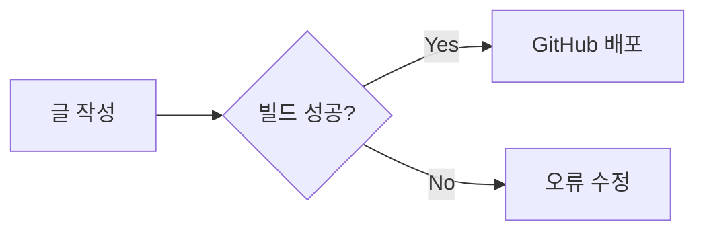

이 포스트는 `jekyll-theme-chirpy` 테마를 기반으로 블로그를 운영하는 방법을 설명합니다. 이 파일의 소스 코드(Markdown) 자체가 하나의 템플릿 역할을 하므로, 새로운 글을 작성할 때 참고용으로 사용하시기 바랍니다.

## 1. 게시글 파일 생성 규칙

게시글 파일은 반드시 `_posts` 디렉토리에 위치해야 하며, 파일 이름은 다음 형식을 엄격히 준수해야 합니다.

**형식:** `YYYY-MM-DD-TITLE.md`
- 예: `2026-02-01-welcome-to-my-blog.md`

## 2. Front Matter 설정 가이드

모든 게시글 최상단에는 `---`로 구분된 설정 영역이 필요합니다. 주요 옵션은 다음과 같습니다.

| 속성 | 설명 | 비고 |
| :--- | :--- | :--- |
| `title` | 게시글 제목 | 문자열 |
| `date` | 작성 시간 | `YYYY-MM-DD HH:MM:SS +0900` |
| `categories` | 카테고리 | `[상위, 하위]` (최대 2단계) |
| `tags` | 태그 | 리스트 형식 |
| `pin` | 메인 상단 고정 | `true` / `false` |
| `toc` | 우측 목차 표시 | 기본값 `true` |
| `math` | 수식(LaTeX) 활성화 | 기본값 `false` |
| `mermaid` | 다이어그램 활성화 | 기본값 `false` |

## 3. 이미지 및 미디어 관리

### 3.1 로컬 이미지 경로
이미지는 보통 `assets/img/` 하위 폴더에 저장합니다.
```markdown

```

### 3.2 대표 이미지 (Preview Image)
Front Matter에 아래 설정을 추가하면 포스트 상단과 SNS 공유 시 이미지가 표시됩니다.
```yaml
image:
  path: /assets/img/sample.jpg
  alt: "이미지 설명"
```

## 4. 특수 기능 활용

### 4.1 수식 (MathJax)
`math: true` 설정 후 LaTeX 문법을 사용합니다.
- 인라인 수식: $a^2 + b^2 = c^2$
- 블록 수식:
$$ \sum_{i=1}^{n} i = \frac{n(n+1)}{2} $$

### 4.2 다이어그램 (Mermaid)
`mermaid: true` 설정 후 아래와 같이 작성합니다.



### 4.3 경고창 (Prompts)
독자의 주의를 끌기 위해 다양한 스타일의 경고창을 사용할 수 있습니다.

> **Tip:** 유용한 팁을 적을 때 사용합니다.
{: .prompt-tip }

> **Info:** 정보를 전달할 때 사용합니다.
{: .prompt-info }

> **Warning:** 주의 사항을 알릴 때 사용합니다.
{: .prompt-warning }

> **Danger:** 심각한 오류나 위험을 경고할 때 사용합니다.
{: .prompt-danger }

## 5. 업데이트 알림

글을 수정한 경우 `last_modified_at` 속성을 추가하면 포스트 하단에 "Updated" 날짜가 표시됩니다.

```yaml
last_modified_at: 2026-02-02 12:00:00 +0900
```

---

이 매뉴얼을 활용해 멋진 기술 블로그를 운영해 보세요! 추가로 궁금한 점이 있으면 언제든 물어봐 주세요.